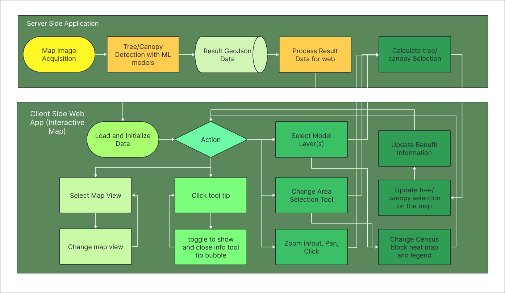

## 🌳 Web Application for Visualizations

This is an interactive web tool where users can:

- **Compare different model results** (tree points, canopy polygons).
- **Select areas** by census block, fixed area, or street segment.
- **Visualize results** as heatmaps and statistics for planning and reporting.
- **Switch between map views**: satellite, street, terrain.
- **Explore detailed tooltips** for map features.

---

### 📁 Project Structure

- **`/srv/`** — Server-side code  
  Contains the Flask application, API endpoints, data processing scripts, and configuration for serving geospatial data and handling user requests.

- **`/client/`** — Client-side pages and static assets  
  Contains HTML, JavaScript, and CSS files responsible for rendering the interactive map UI, visualizations, and user interactions in the browser.

---

### 🧭 Web App Architecture & Flow

---

### 🛠️ Tools and Platform

- **Leaflet**  
  A lightweight open-source JavaScript library for interactive maps.  
  _Chosen for its simplicity and flexibility in rendering geospatial data directly in the browser, perfect for integrating with custom map layers and user interactions._

- **OpenStreetMap**  
  A free, editable map of the world built by a community of mappers.  
  _Used as the base tile layer for maps in Leaflet, offering an open, community-driven alternative to Google Maps without API quotas or fees._

- **AWS (Amazon Web Services)**  
  Provides scalable cloud infrastructure.  
  _Chosen to host the Flask server and support backend services with reliable uptime, scalability, and integration with tools like EC2, S3, and Route 53._

- **Bootstrap**  
  A responsive front-end CSS framework.  
  _Used for layout and UI consistency across devices, enabling rapid development of responsive, mobile-friendly pages with minimal custom styling._
